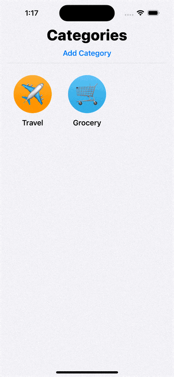
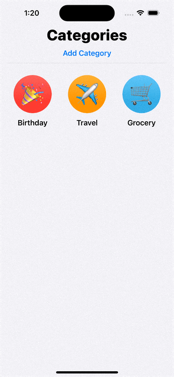
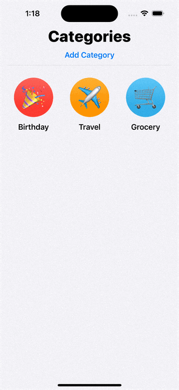

# Core Data Todo App
An iOS todo list app using one to many relation core data model.

# Features
1. Add new category list with name, Emoji icon, and color.
2. Edit Category list name, Emoji icon, or color.
3. Add todo items in each category
4. Update state condition of each item (Completed or not)
5. Clear all completed tasks in the list
6. Show/Hide all completed tasks
7. Delete the category list

# Demo
!
!
!

# License
**TodoApp** is under MIT license. See the [LICENSE](LICENSE) file for more info.
